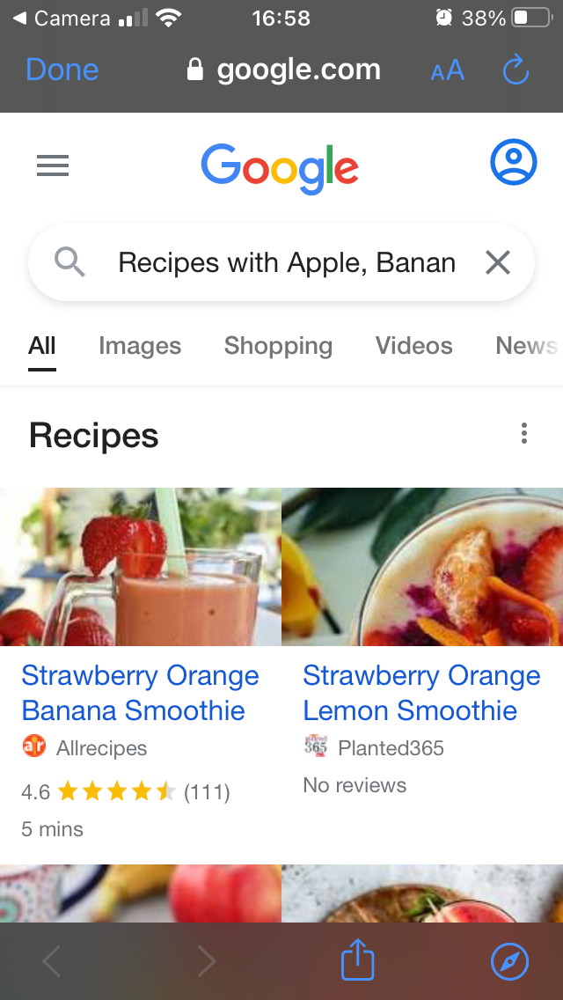

# Leftovers-Recipe-Finder-App
Finds recipes for you from a selected list of leftover ingredients. Solo React Expo mobile app project from SWEN325 in 2021 at VUW.

## Create Account Screen/App’s landing page
Users can create new accounts here. If a user is returning to the app and already has an 
account, they can select the “LOG IN” button to be directed to the Login page.
In retrospect, I would improve this by not requiring the user to create an account to use the
app. Rather, the app should always offer its main functionality from app launch regardless of 
whether the user is logged into an account or not. Logging into an account would only be for 
persisting a user’s Favourite ingredients and Recently Searched ingredients.

## Login page
Here users may enter login credentials to load favourite and recently used ingredients from 
an existing account into the app.

## Ingredient Selection page
This is the main screen of the app. Here, users may expand food categories and select 
ingredients within them.
This screen also shows all or a preview of all a user’s favourite ingredients (if they have any 
favourite ingredients). It also shows a user’s recently searched ingredients (specifically, 
ingredients used to find recipes with up to 3 recipe searches ago) in a similar fashion.
The user may also search for ingredients using the search bar in the header of the screen. If 
this search bar holds any text, the results of the search will replace the contents of this 
screen.

## Ingredient Selection screen with expanded food category, visible Favourite Ingredients section and visible Recently Used Ingredients section

## Ingredient Modal Popup
After holding and pressing on an ingredient button, a modal popup about that ingredient 
will appear. This also includes a star icon that can be toggled to set the ingredient in 
question to mark it as one of the user’s favourite ingredients.

## Selected Ingredients Display
Pressing the “Selected” button in the Ingredient Selection screen’s footer will open this 
screen to show all currently selected ingredients.

## Recipe Results via Google Search in an in-app browser
Pressing the “Find Recipes” button in the Ingredient Selection screen’s footer will open an 
in-app browser with a Google search for recipes using the selected ingredients.

## All Favourite Ingredients Display
When the user has 5 or more favourites ingredients, a “See all..” link will be visible in the
“Favourite Ingredients” section. Tapping this link leads to this screen, which shows all of the 
user’s favourite ingredients in one screen.

## All Recently Searched/Used Ingredients Display
Similar to the “All Favourite Ingredients Display”, this screen is accessed from the 
Ingredients Selection screen through a “See all..” link in the “Recently Used Ingredients”
section. It shows all ingredients used in the 3 most recent recipe searches made when 
opening the in-app browser with the “Find Recipes” button.

